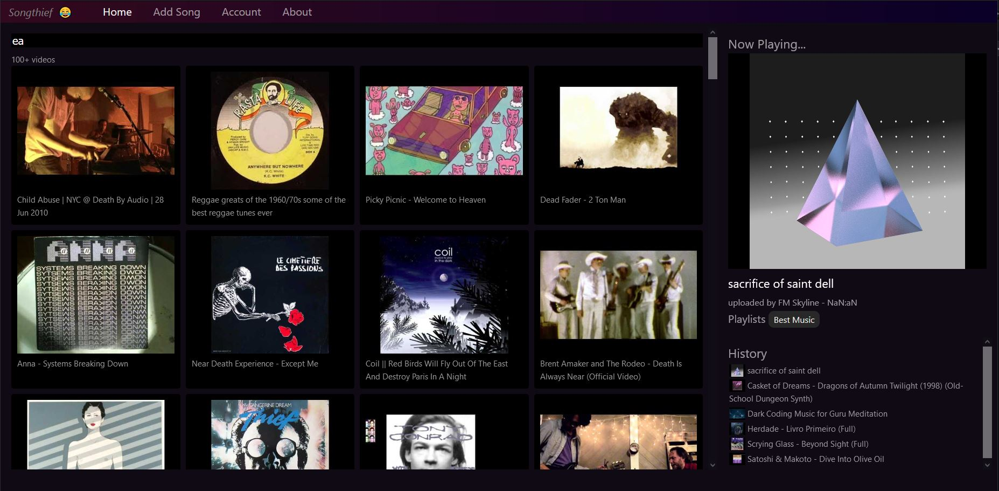

# Songthief  🎵 💰🔫 🔑🔓 ©🚫 



## Overview
Songthief is a web interface for browsing your music that happens to be stored on big shitty corporate sites. It is especially targeted at youtube which is slow and has very poor playlist management. Import your playlists once, then seach and stream those youtube videos right in songthief's UI! Searching and playlist management is lightning fast, because it's stored on our side. Currenly hoping to support embed players for soundcloud and bandcamp as well.

Songthief doesn't save any media locally, we're basically riding on the fact that these big companies have to keep their CDNs open. It's like creating your own card catalog for the bookstore around the corner. Your shop is my library, because i can just go in and read it there! This doesn't solve content removal, but if the CDN does delete the media data the entry with title and uploader will still be in songthief's database.

Songthief aims to be run as an instance for one person / a group of friends. It will never be designed to support hundreds or thousands of users.

## Tech Basics
"We host nothing!"

Songthief **doesn't use any external APIs** for managing song info, making it very fast and very very free. Each 'song' in the database is just a title and one or more content IDs from an external playform.

When you click a particular song, we add the owning service's embed media player directly onto the page and auto play it. Just like if you hit share->embed on youtube. This is usually as fast (or faster!) than clicking links within a given service's website, probably because we don't have any frontend or account info overhead but the youtube CDNs are crazy fast. Likewise album art or other thumbnails are linked directly from those same CDNS.

## Deployment

The following environment variables control the app.
The shadow database needs to be a second (empty) database with open permissions to the user.
```
MYSQL_DATABASE=songthief
MYSQL_DATABASE_SHADOW=prisma_shadow
MYSQL_USER=songthief
MYSQL_PASSWORD=songthiefpassword
INITIAL_ADMIN_USER=admin
INITIAL_ADMIN_PASSWORD=apfelbauer
```

## Roadmap

- basic <-- here now
- use backend properly with user account
- test support for other media providers like soundcloud and bandcamp
- add multi user (but partitioned views)
- multi user with sharing / playlist visibility
- recommendations? manually currated perhaps

## Developer Setup
There are two directories, frontend and api. frontend is a totally standard vue3/vuex/vue-router singlepage app. It only needs to talk to the songthief api. When built it's served as static files directly from the api, so you dont need to run two servers in production. The api is an express app using prisma for the database connection. So far we do not use typescript.

run `npm install` in both subdirectories, obviously :)

Bandwidth required to run this app should be minimal beyond the large payload of song data. Frontend should load once, and then make a few requests to the API to get it's data. The searching and playing of songs all happens on the frontend.

## Deployment plans
Let's use docker? Can we make a simple button for deploying to digital ocean?

Future docker build steps:
- npm install the front end
- build the frontend
- copy it to the api's static directory
- npm install the api
- save as image
- push up to digital ocean

## How to get data in at first
You can add and remove new items manually, or do a one-time import of a given service's playlist information. To keep songthief easy, we dont have any method for connecting to those yucky corporate APIs directly.

For youtube, youtube-dl utility for downloading all items in a playlist with a decent amount of meta https://jordanelver.co.uk/blog/2020/06/11/get-video-urls-from-a-youtube-playlist/ . It works **without needing a youtube API key** so it's great!! I had some pain in the ass python2/3 shit, had to fix my installing 2 and forcing it priority https://www.vultr.com/docs/how-to-install-python-2-on-ubuntu-20-04/. If it's possible in the future, it would be sick to embed this in our API but also ehhhh?